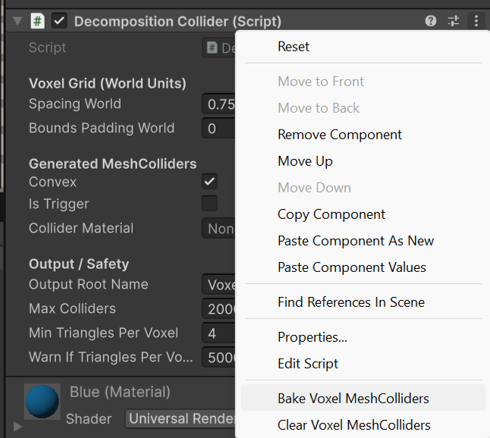

# Unity Non-Convex Mesh Colliders
### Non-convex collider approximations that work with rigid bodies

This project provides **three different approaches** to approximate **non-convex MeshColliders** in Unity **while remaining compatible with rigid bodies**.

Unity does not allow non-convex MeshColliders on non-kinematic rigid bodies.  
The systems in this repository work around this limitation by decomposing complex meshes into **multiple simpler colliders** that can safely participate in Unity’s physics simulation.

The focus is on:
- **Robust runtime behavior**
- **Editor-time baking**
- **Configurability and clarity**
- **Minimal assumptions about mesh topology**

---
▶ **Demo:**  https://www.youtube.com/shorts/yHOCyl136nw
---

## 🧩 DecompositionCollider
**Voxel-based mesh decomposition into multiple MeshColliders**

The `DecompositionCollider` splits a mesh into spatial regions using a voxel grid.  
All triangles overlapping a voxel are grouped together and converted into a separate MeshCollider.

Each voxel group produces a **small, locally convex (or nearly convex) mesh**, allowing the resulting colliders to work reliably with rigid bodies.

### Key characteristics
- Voxel grid based on mesh bounds
- Triangle grouping via AABB overlap
- One MeshCollider per voxel group
- Optional convex enforcement
- Editor-time baking

### Use cases
- Large, complex static or dynamic meshes
- Objects that must interact physically with rigid bodies
- Replacing expensive or invalid non-convex MeshColliders

## 🧊 VoxelCollider
**Solid voxel-based BoxCollider approximation**

The `VoxelCollider` fills the interior of a mesh using a voxel grid and generates **BoxColliders** for all voxels that lie inside the mesh.

An optional greedy merge step combines adjacent voxels into larger boxes, drastically reducing collider count while keeping a good approximation.

### Key characteristics
- Inside-test using ray–triangle intersection
- BoxCollider generation (physics-friendly)
- Optional voxel merging
- Very stable for dynamic rigid bodies

### Use cases
- Performance-critical collision
- Rough but solid volume approximation
- Physics-heavy scenes with many interacting objects

## 🔵 PoissonDiscCollider
**Surface-based sphere collider approximation**

The `PoissonDiscCollider` samples points on the surface of a mesh using Poisson disk sampling.  
Each sample point generates a SphereCollider, resulting in an even, surface-aligned collider distribution.

The points can optionally be inset along triangle normals to avoid surface penetration issues.

### Key characteristics
- Area-weighted triangle sampling
- Evenly distributed surface points
- SphereCollider output
- Adjustable density and radius

### Use cases
- Organic or irregular meshes
- Soft or rounded collision behavior
- Low-cost approximation for complex shapes

## ⚠️ Limitations

- These are **approximations**, not exact replacements
- Very small voxel sizes may lead to high collider counts
- Convex MeshColliders still inherit Unity’s convex hull limitations

